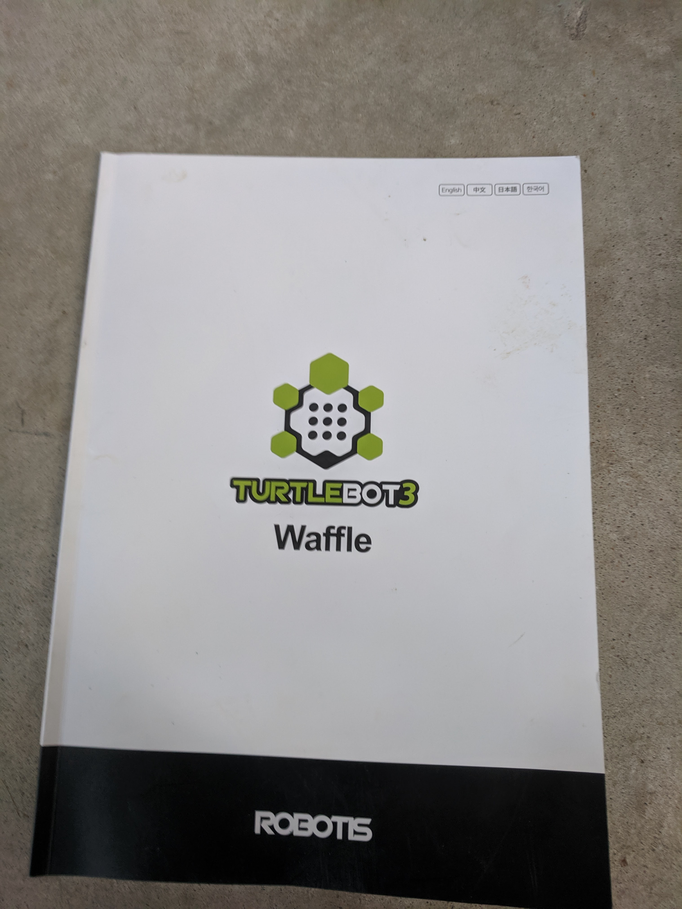

# TurtleBot3 Waffle

## The whole kit
Everything included in the sale

## Manual

## The TurtleBot3
Oblique views

Front view; RealSense, PCB, battery

Side view; USB hub connections

## Briefly powered on

## Accessory box 1

## Accessory box 2

## TurtleBot3 delicate parts removed for shipment

